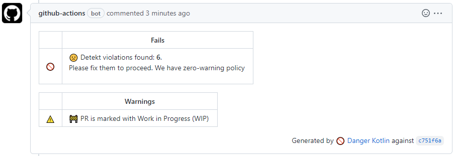
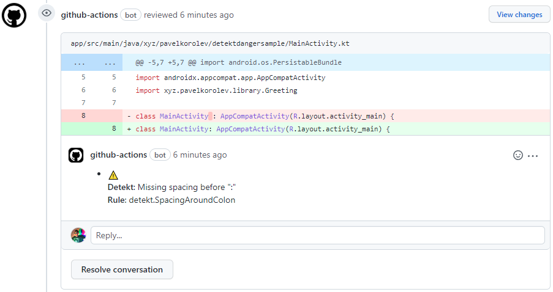
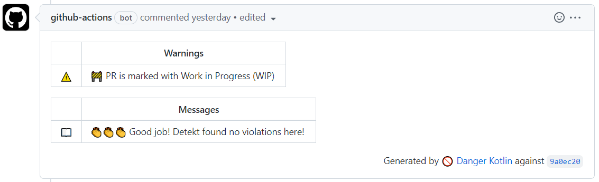

[ ](https://maven-badges.herokuapp.com/maven-central/xyz.pavelkorolev.danger.detekt/plugin)

# Detekt Plugin for Danger Kotlin

Plugin for [danger/kotlin](https://github.com/danger/kotlin) which helps to parse and report [detekt](https://github.com/detekt/detekt) violations from its XML report files.

## How it looks like

Depends on you. We constrained only with **detekt/kotlin** file and line appearance, and repository hosting (e.g. **GitHub**) markdown capabilities. Anything else is customizable.

### Like this



### With inline comments



### Or this



## Usage

`Dangerfile.df.kts` is the main configuration file of any **danger/kotlin** setup. To use this plugin you should add it as a dependency on top of this file and call register.

```kotlin
@file:DependsOn("xyz.pavelkorolev.danger.detekt:plugin:x.y.z")

register.plugin(DetektPlugin)
```

### Basic

#### Single file parse and report

This does what it says. If you have one detekt report and don't want any customization - that's probably your choice.

```kotlin
DetektPlugin.parseAndReport(reportFile)
```

#### Multiple files parse and report

Actually parameters of all `parse` functions are `varargs`, so you could provide it as many report files as you want.

```kotlin
DetektPlugin.parseAndReport(reportFile1, reportFile2, reportFile3)
```

or

```kotlin
val files: Array<File> = findReportFilesByYourself()
DetektPlugin.parseAndReport(*files)
```

### Parse

You could also parse files without immediate reporting.

```kotlin
val report: DetektReport = DetektPlugin.parse(files)
```

This `DetektReport` contains everything from parsed detekt reports, so it could be useful you want to check something before actual reporting.

### Report

You could also report it like this

```kotlin
DetektPlugin.report(report)
```

Please note, in order to make danger report files correctly you should configure detekt to return paths relative to working directory.

```kotlin
detekt {
    basePath = rootDir.absolutePath
}
```

## Full example

```kotlin
@file:DependsOn("xyz.pavelkorolev.danger.detekt:plugin:x.y.z")

import systems.danger.kotlin.*
import systems.danger.kotlin.models.github.*
import xyz.pavelkorolev.danger.detekt.DetektPlugin
import java.io.File

register.plugin(DetektPlugin)

danger(args) {
    warnDetekt()
}

fun warnDetekt() {
    val file = File("build/reports/detekt/report.xml")
    if (!file.exists()) {
        warn(
            "🙈 No detekt report found",
        )
        return
    }
    with(DetektPlugin) {
        val report = parse(file)
        val count = report.count
        if (count == 0) {
            message("👏👏👏 Good job! Detekt found no violations here!")
            return
        }
        fail(
            "🙁 Detekt violations found: **${report.count}**.\n" +
                    "Please fix them to proceed. We have zero-warning policy"
        )
        report(report)
    }
}
```

## Customization

Functions `DetektPlugin.report` and `DetektPlugin.parseAndReport` have `reporter: DetektErrorReporter` parameter, which is in fact a functional interface with `report(error: DetektError, fileName: String?)` function.

By implementing this you could customize reporting logic and appearance as you want.

By default, there is [DefaultDetektErrorReporter](https://github.com/pavelkorolevxyz/danger-detekt-kotlin/blob/12705b550408c42331fa9c4b434a2b62dc16d7f7/plugin/src/main/kotlin/xyz/pavelkorolev/danger/detekt/DetektErrorReporter.kt#L33) which has its own opinionated way to create messages and respect violations severities.

`DefaultDetektErrorReporter` uses inline comments if file and line provided for error. If you want to use only global report without inline comments then use `DefaultDetektErrorReporter(context, isInlineEnabled = false)` instead.

### Implementation

Let's say you want to send everything found into fail table with emojis at the end. Write it like this.

```kotlin
class FailReporter(private val context: DangerContext) : DetektErrorReporter {

    override fun report(error: DetektError, fileName: String?) {
        val message = error.message ?: return
        context.fail("$message 💥💥💥")
    }
}
```

And use it like this

```kotlin
DetektPlugin.report(report, reporter = FailReporter(context))
```

Or you could implement the same as inline reporter thanks to its functional interface nature like so.

```kotlin
plugin.report(report) { error, _ ->
    error.message?.let(context::fail)
}
```

## Ideas

- You may want to send some warning if there are no detekt reports at all. Maybe something went wrong and detekt didn't even run for this build.
- You may want to check violations count before reporting. If nothing found say "Good job" to PR author. Be grateful for such moments, appreciate your colleagues work.
- You may want to check violations count to NOT send huge comments into PR. GitHub for example has a limitation on comment size. If there are many violations then Danger will fail sending them. Set a reasonable limit and print some generic message instead.
- You even may want to check if some violations reported in someone's module or directory to mention them automatically.
- Add a ton of emojis. Everyone loves them. Just kidding 😁. Or not 🤔.

## Side notes

This plugin is heavily inspired by [AckeeCZ/danger-kotlin-detekt](https://github.com/AckeeCZ/danger-kotlin-detekt) which is great, but lacks of customization and preliminary checks capabilities.
